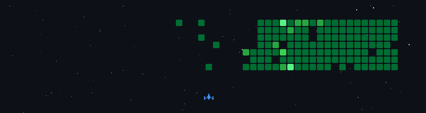

<h1 align="center">Hi 👋, I'm Roshan Dhangar..</h1>

____________________________________________________________________________________

## 🎓 about me 

💻 2nd Year Electronics & Telecommunication Engineering Student  
🚀 Currently learning new technologies.

🌱 Improving problem-solving skills  
📌 passionate about coding and building projects .

[

  __________________________________________________________________________________

  ## 💼 Internship Experience

### IoT Intern | Emertxe
📅 March 2026 – April 2026

- Successfully completed Internship on Internet of Things (IoT)
- Learned C programming and Microcontrollers
- Worked on SDLC based IoT project building
- Gained hands-on exposure to Embedded Systems and Bluetooth communication

 ______________________________________________________________________________

## 📚 Academic Projects

### 🔹 Bluetooth LED Control using Arduino UNO
- HC-05 Bluetooth module based wireless LED control
- Mobile app controlled ON/OFF system
- Implemented using Arduino IDE and Embedded C
- Learned Bluetooth communication and hardware interfacing

 
___________________________________________________________________________________

## 📊 My Activity Graph

  

______________________________________________________________________________

## ■ My GitHub

  

