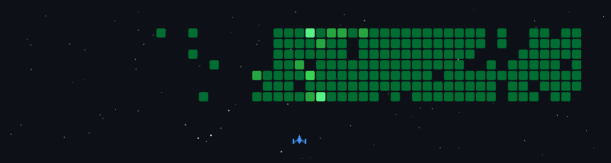

<h1 align="center">Hi 👋, I'm Roshan Dhangar</h1>

<h3 align="center">
Electronics Engineering Student | Embedded Systems Learner | C & Java Programmer
</h3>

  

  

## 👨‍💻 About Me

* 🔹 Currently learning **C, Embedded C, Core Java, Git, GitHub, and Data Structures & Algorithms (DSA)**
* 🔹 Completed an **IoT Internship at Emertxe**
* 🔹 Built a **Bluetooth Smart Light Control System** using **Arduino UNO and HC-05 Bluetooth Module**
* 🔹 Practicing **Java and C programming** to strengthen my coding and problem-solving skills
* 🔹 Actively solving problems on **LeetCode** and sharing my coding journey on **GitHub**
* 🔹 Interested in **Embedded Systems, Firmware Development, and Software Development**

-------------------------------------------------------------------------------

## 🌐 Socials:

 
-----------------------------------------------------------------------------

## 💼 Internship Experience

### IoT Intern | Emertxe
📅 March 2026 – April 2026

- Successfully completed an Internship in Internet of Things (IoT)
- Learned C programming and Microcontrollers
- Worked on an SDLC-based IoT project
- Gained hands-on exposure to Embedded Systems and Bluetooth communication

-----------------------------------------------------------------------------------

## 📚 Academic Projects

### 🔹 Bluetooth Smart Light Control System

- Developed a Bluetooth-based wireless LED control system using the HC-05 module
- Mobile app controlled ON/OFF system
- Implemented using Arduino IDE and Embedded C
- Learned Bluetooth communication and hardware interfacing

 
---------------------------------------------------------------------------------

# 💻 Tech Stack:

## 📊 GitHub Analytics

  
  
  

  

--------------------------------------------------------------------------------------

## 📈 Contribution Activity

  

--------------------------------------------------------------------------------------
## 🚀 Thanks for Visiting My Profile !

  

  ⭐ Thanks for visiting my profile! Feel free to explore my repositories and connect with me.

